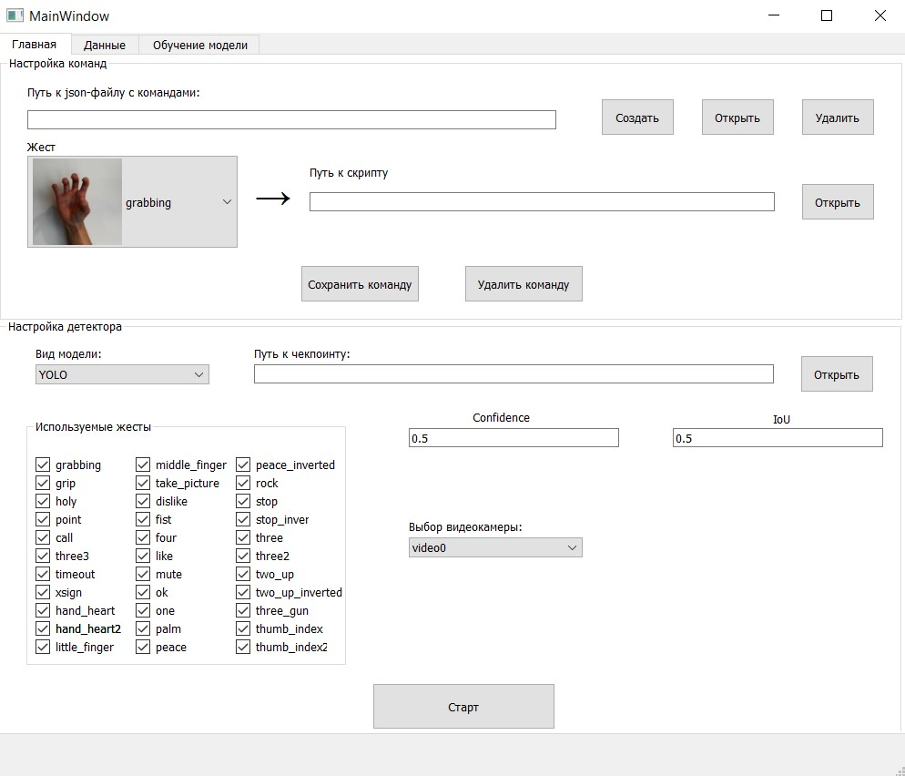
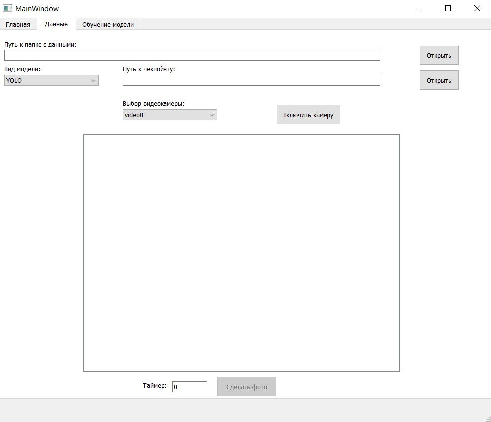
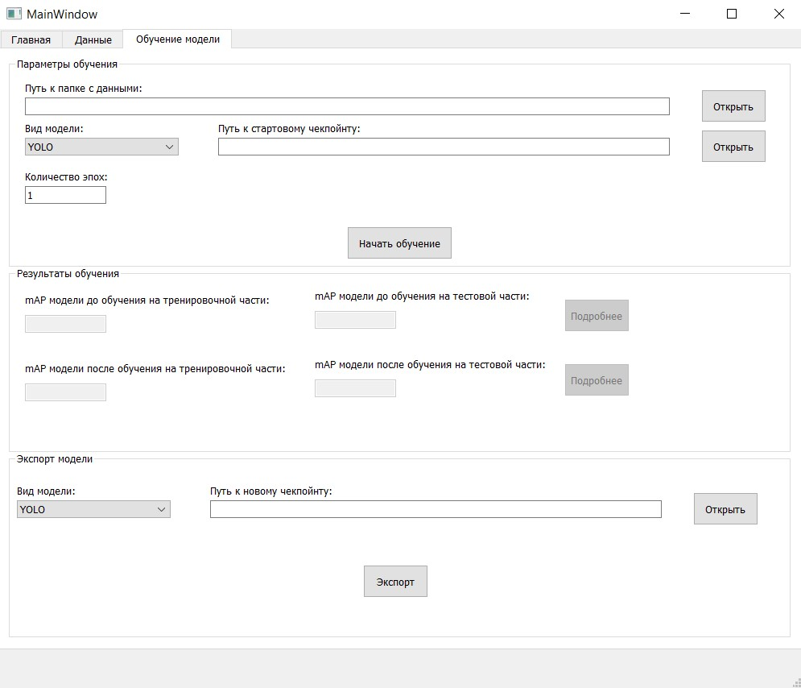

# Motion Computer Control

Суть проекта заключается в разработке приложения, 
позволяющего контролировать некоторые действия компьютера с помощью жестов. 
Поступающее с веб-камеры изображение должно обрабатываться заранее обученной моделью, 
а затем, в зависимости от конкретного распознанного жеста, 
должна срабатывать та или иная последовательность заранее заданных действий.

## Требования:

1. Модель должна работать в реальном времени на среднем ноутбуке — соответственно, нужна хорошая скорость инференса.  
2. Модель должна распознавать жесты. Соответственно, классов в данной задаче может быть много, и они должны хорошо распознаваться.  
3. Жесты должны распознаваться стабильно, и единичные ложные срабатывания не должны влиять на работу программы.
4. Помимо этого должна быть возможность распознавать комбинацию жестов или движений рукой — чтобы сложные движения тоже могли быть восприняты как команды.  
5. Также нужен отдельный функционал, с помощью которого конкретный жест или комбинация жестов переводится в команду или набор команд.  

## План работы:

Несмотря на то, что этот план расписан по дням, строгих требований к времени выполнения работы нет. 
Как выяснилось в процессе, по ходу работы требования к проекту могут разрастаться, а план может корректироваться. 
Поэтому данная оценка лишь примерная и дана до начала выполнения требований из расчёта, 
что каждый день будет тратиться 3-4 часа на разработку.  
- ~~1-ый день. Подготовить проект к началу работы (git, docker).~~  
- ~~2-ой день. Выбрать предобученные модели. Обернуть их в свой класс для единообразия интерфейса.~~  
- ~~3-ий день. Сделать функционал для выполнения команд, привязанных к распознаванию определённых жестов. 
Сделать тестовый вариант программы.~~  
- 4-ый, 5-ый, 6-ой дни. Сделать интерфейс на PyQT. Интерфейс должен иметь 3 панели: 
    1. Для дообучения модели.
    2. Для её тестирования и экспорта в формат onnx.
    3. Для объединения конкретных жестов с конкретными командами (причём жесты могут запускать как упрощённые команды (конкретные сочетания клавиш), так и запускать отдельные python-файлы) и запуска приложения.  
- 7-ой и 8-ой дни. Реализовать функционал интерфейса.
- 9-ый и 10-ый дни. Тестирование, исправление багов, рефакторинг (если нужно).  

## Ход работы.

### Запуск приложения:

Для тестирования приложения используется docker. В директории проекта открываем консоль и сначала используем

`docker build -t <название_образа> .`

Затем

`docker run --device=/dev/video0 <название_образа>` (камера подключается только на Linux)

### Выбор и обучение модели:

Т.к. скорость инференса в решаемой задаче должна быть высокой, то выбор модели встал между 
YOLO и SSDLite на MobileNetv3. В конце концов было решено реализовать функционал и с той, и с той моделью.  
Изначально предполагалось, что будет взята стандартная модель, обученная на датасете COCO, 
и далее она будет дообучена на выборке с изображениями, содержащими размеченные жесты. 
Но как выяснилось, в этом нет необходимости: такая задача уже решалась, 
и здесь (https://github.com/hukenovs/hagrid?tab=readme-ov-file) 
можно найти как выборку с жестами, так и обученные baseline-модели. 
Поэтому теперь задача состоит не в том, чтобы взять модель, обученную на COCO, 
и дообучить её на выборке с жестами, а в том, чтобы взять модель, обученную на выборке 
с жестами, и дообучить её конкретно под себя. Посмотреть, какие жесты с моей 
веб-камеры модели распознают плохо (с моим качеством изображения, с моим освещением и т.д.), 
и подправить качество именно на них.  
Модели YOLO и SSDLite неудобно использовать из pytorch, а из ultralytics можно использовать только YOLO. 
Поэтому для этих двух моделей (а также для моделей формата onnx) было решено реализовать обёртку в виде единого класса. 
Он представлен в файле GestureDetector.py и называется также.  

Метки соответствуют жестам следующим образом:  
0 = 'grabbing'  
1 = 'grip'  
2 = 'holy'  
3 = 'point'  
4 = 'call'  
5 = 'three3'  
6 = 'timeout'  
7 = 'xsign'  
8 = 'hand_heart'  
9 = 'hand_heart2'  
10 = 'little_finger'  
11 = 'middle_finger'  
12 = 'take_picture'  
13 = 'dislike'  
14 = 'fist'  
15 = 'four'  
16 = 'like'  
17 = 'mute'  
18 = 'ok'  
19 = 'one'  
20 = 'palm'  
21 = 'peace'  
22 = 'peace_inverted'  
23 = 'rock'  
24 = 'stop'  
25 = 'stop_inverted'  
26 = 'three'  
27 = 'three2'  
28 = 'two_up'  
29 = 'two_up_inverted'  
30 = 'three_gun'  
31 = 'thumb_index'  
32 = 'thumb_index2'  
33 = 'no_gesture'  
См. подробнее в первоисточнике: https://github.com/hukenovs/hagrid?tab=readme-ov-file   

### Функционал для выполнения команд при распознавании жестов:

Для того, чтобы по распознаванию жестов выполнялся определённый алгоритм действий, был написан класс CommandExecutor, 
представленный в файле CommandExecutor.py. У него есть два публичных метода - create_command и execute_command. 
Первый позволяет связывать последовательность жестов с конкретным файлом-скриптом, написанном на языке python. 
Второй метод, как следует из названия, служит для исполнения команды. 
В нём определяется, связана ли текущая последовательность жестов какой-либо команде, и если такая связь есть, 
то запускается соответствующий скрипт. К скриптам есть определённые требования, а именно:  
1. В скрипте должна быть функция с названием main. Именно она и запускается через execute_command.  
2. У функции main должно быть три аргумента на входе: в качестве первого в функцию подаётся последовательность жестов, 
в качестве второго подаётся последовательность координат, соответствующих каждому жесту, а в качестве третьего подаётся 
словарь command_variables, который является полем объекта CommandExecutor и нужен для связи между разными скриптами.  
3. Функция main должна возвращать словарь. Вне скрипта (при выполнении execute_command) этот словарь присваивается полю 
command_variables, которое обсуждалось выше. Таким образом можно из одного своего скрипта получать значения переменных 
в другом скрипте. Например, можно одним жестом заблокировать действия других жестов, и наоборот.  

Пример использования класса CommandExecutor, а также тестовую версию программы можно найти в файле test.py. 
Тестовые скрипты находятся в папке Algorithms.

### Интерфейс.

Интерфейс программы создан на PyQT5 с помощью дизайнера, затем ui-файл был конвертирован в py-файл, где далее 
интерактивным элементам вручную добавлена функциональность, а также прописана логика работы программы. Ниже
представлен внешний вид программы:
1. Вкладка "Главная":

2. Вкладка "Данные":

3. Вкладка "Обучение модели":

Особенности и логика работы каждого отдельного элемента будут рассмотрены в следующем разделе.

