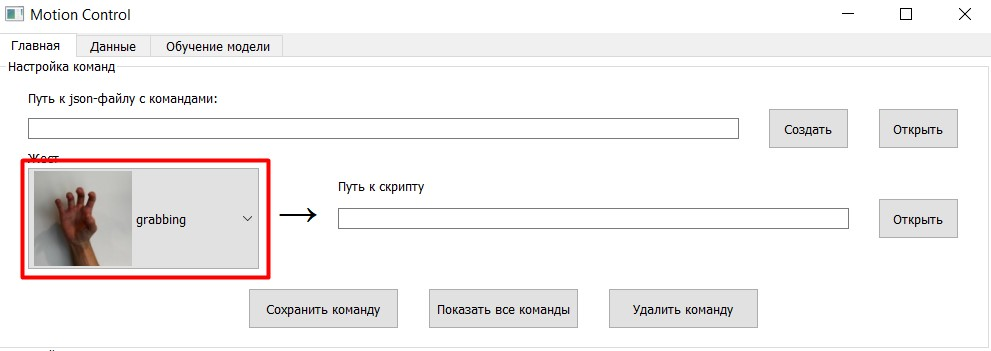

# Motion Computer Control

Суть проекта заключается в разработке приложения, 
позволяющего контролировать некоторые действия компьютера с помощью жестов. 
Поступающее с веб-камеры изображение должно обрабатываться заранее обученной моделью, 
а затем, в зависимости от конкретного распознанного жеста, 
должна срабатывать та или иная последовательность заранее заданных действий.

## Требования:

1. Модель должна работать в реальном времени на среднем ноутбуке — соответственно, нужна хорошая скорость инференса.  
2. Модель должна распознавать жесты. Соответственно, классов в данной задаче может быть много, и они должны хорошо распознаваться.  
3. Жесты должны распознаваться стабильно, и единичные ложные срабатывания не должны влиять на работу программы.
4. Помимо этого должна быть возможность распознавать комбинацию жестов или движений рукой — чтобы сложные движения тоже могли быть восприняты как команды.  
5. Также нужен отдельный функционал, с помощью которого конкретный жест или комбинация жестов переводится в команду или набор команд.  

## План работы:

Несмотря на то, что этот план расписан по дням, строгих требований к времени выполнения работы нет. 
Как выяснилось в процессе, по ходу работы требования к проекту могут разрастаться, а план может корректироваться. 
Поэтому данная оценка лишь примерная и дана до начала выполнения требований из расчёта, 
что каждый день будет тратиться 3-4 часа на разработку.  
- ~~1-ый день. Подготовить проект к началу работы (git, docker).~~  
- ~~2-ой день. Выбрать предобученные модели. Обернуть их в свой класс для единообразия интерфейса.~~  
- ~~3-ий день. Сделать функционал для выполнения команд, привязанных к распознаванию определённых жестов. 
Сделать тестовый вариант программы.~~  
- ~~4-ый, 5-ый, 6-ой дни. Сделать интерфейс на PyQT. Интерфейс должен иметь 3 панели:~~ 
    ~~1. Для дообучения модели.~~
    ~~2. Для её тестирования и экспорта в формат onnx.~~
    ~~3. Для объединения конкретных жестов с конкретными командами (причём жесты могут запускать как упрощённые команды (конкретные сочетания клавиш), так и запускать отдельные python-файлы) и запуска приложения.~~  
- ~~7-ой и 8-ой дни. Реализовать функционал интерфейса.~~
- 9-ый и 10-ый дни. Тестирование, исправление багов, рефакторинг (если нужно).  

## Ход работы.

### Запуск приложения:

Для тестирования приложения используется docker. В директории проекта открываем консоль и сначала используем

`docker build -t <название_образа> .`

Затем

`docker run --device=/dev/video0 <название_образа>` (камера подключается только на Linux)

### Выбор и обучение модели:

Т.к. скорость инференса в решаемой задаче должна быть высокой, то выбор модели встал между 
YOLO и SSDLite на MobileNetv3. В конце концов было решено реализовать функционал и с той, и с той моделью.  
Изначально предполагалось, что будет взята стандартная модель, обученная на датасете COCO, 
и далее она будет дообучена на выборке с изображениями, содержащими размеченные жесты. 
Но как выяснилось, в этом нет необходимости: такая задача уже решалась, 
и здесь (https://github.com/hukenovs/hagrid?tab=readme-ov-file) 
можно найти как выборку с жестами, так и обученные baseline-модели. 
Поэтому теперь задача состоит не в том, чтобы взять модель, обученную на COCO, 
и дообучить её на выборке с жестами, а в том, чтобы взять модель, обученную на выборке 
с жестами, и дообучить её конкретно под себя. Посмотреть, какие жесты с моей 
веб-камеры модели распознают плохо (с моим качеством изображения, с моим освещением и т.д.), 
и подправить качество именно на них.  
Модели YOLO и SSDLite неудобно использовать из pytorch, а из ultralytics можно использовать только YOLO. 
Поэтому для этих двух моделей (а также для моделей формата onnx) было решено реализовать обёртку в виде единого класса. 
Он представлен в файле GestureDetector.py и называется также.  

Метки соответствуют жестам следующим образом:  
0 = 'grabbing'  
1 = 'grip'  
2 = 'holy'  
3 = 'point'  
4 = 'call'  
5 = 'three3'  
6 = 'timeout'  
7 = 'xsign'  
8 = 'hand_heart'  
9 = 'hand_heart2'  
10 = 'little_finger'  
11 = 'middle_finger'  
12 = 'take_picture'  
13 = 'dislike'  
14 = 'fist'  
15 = 'four'  
16 = 'like'  
17 = 'mute'  
18 = 'ok'  
19 = 'one'  
20 = 'palm'  
21 = 'peace'  
22 = 'peace_inverted'  
23 = 'rock'  
24 = 'stop'  
25 = 'stop_inverted'  
26 = 'three'  
27 = 'three2'  
28 = 'two_up'  
29 = 'two_up_inverted'  
30 = 'three_gun'  
31 = 'thumb_index'  
32 = 'thumb_index2'  
33 = 'no_gesture'  
См. подробнее в первоисточнике: https://github.com/hukenovs/hagrid?tab=readme-ov-file   

### Функционал для выполнения команд при распознавании жестов:

Для того, чтобы по распознаванию жестов выполнялся определённый алгоритм действий, был написан класс CommandExecutor, 
представленный в файле CommandExecutor.py. У него есть два публичных метода - create_command и execute_command. 
Первый позволяет связывать последовательность жестов с конкретным файлом-скриптом, написанном на языке python. 
Второй метод, как следует из названия, служит для исполнения команды. 
В нём определяется, связана ли текущая последовательность жестов какой-либо команде, и если такая связь есть, 
то запускается соответствующий скрипт. К скриптам есть определённые требования, а именно:  
1. В скрипте должна быть функция с названием main. Именно она и запускается через execute_command.  
2. У функции main должно быть три аргумента на входе: в качестве первого в функцию подаётся последовательность жестов, 
в качестве второго подаётся последовательность координат, соответствующих каждому жесту, а в качестве третьего подаётся 
словарь command_variables, который является полем объекта CommandExecutor и нужен для связи между разными скриптами.  
3. Функция main должна возвращать словарь. Вне скрипта (при выполнении execute_command) этот словарь присваивается полю 
command_variables, которое обсуждалось выше. Таким образом можно из одного своего скрипта получать значения переменных 
в другом скрипте. Например, можно одним жестом заблокировать действия других жестов, и наоборот.  

Пример использования класса CommandExecutor, а также тестовую версию программы можно найти в файле test.py. 
Тестовые скрипты находятся в папке Algorithms.

### Интерфейс.

Интерфейс программы создан на PyQT5 с помощью дизайнера, затем ui-файл был конвертирован в py-файл, где далее 
интерактивным элементам вручную добавлена функциональность, а также прописана логика работы программы. Ниже
представлен внешний вид программы:
1. Вкладка "Главная":

2. Вкладка "Данные":

3. Вкладка "Обучение модели":

Особенности и логика работы каждого отдельного элемента будут рассмотрены в следующем разделе.

### Функционал интерфейса.

В ходе реализации этого пункта были переработаны многие ранее реализованные части программы, 
и на эту часть работы ушло гораздо больше времени, чем изначально планировалось. 
Изменения затронули почти каждый предыдущий пункт. Так, финальная версия интерфейса выглядит следующим образом:  
1. Вкладка "Главная":  

2. Вкладка "Данные":  

3. Вкладка "Обучение модели":  

Разберём подробно функционал представленного выше интерфейса.

**1. Главная.**  
Вкладка "Главная" состоит из двух блоков - "Настройка команд" и "Настройка детектора". 
В блоке "Настройка команд" находятся элементы, отвечающие за подключение конкретных алгоритмов к конкретным жестам:  
1. Создание файла с командами.  
  
Если ни одного файла с командами не существует, либо если нужен новый файл с командами, то его можно создать, 
нажав на указанную выше кнопку. Откроется стандартное окно выбора файла, в котором можно указать путь к создаваемому файлу.
После этого по указанному адресу будет создан пустой json-файл, в котором в будущем можно будет записывать команды.  
2. Загрузка файла с командами.  
   
Здесь же находится и кнопка "Открыть", с помощью которой можно указать путь к уже имеющемуся json-файлу с командами.

В созданный или загруженный json-файл можно добавлять команды, а также их можно удалять. Ниже мы разберём, 
как это делается.   
3. Выбор жеста.
   
Данный выпадающий список позволяет выбирать жест, который будет вызывать ту или иную последовательность действий.
Всего доступно для выбора 33 жеста.  
4. Выбор алгоритма.  
   
С помощью данной кнопки можно указать путь к python-скрипту, который должен запускаться при детектировании 
указанной команды.  
ВАЖНО! В указанном скрипте обязательно должна быть функция main (именно она и запускается), принимающая 3 аргумента
(gesture_seq, coords_seq, command_variables) и возвращающая словарь command_variables. В качестве первого аргумента 
принимается номер жеста, в качестве второго координаты жеста на изображении, а в качестве третьего словарь, 
разделяемый между всеми пользовательскими алгоритмами. Данный словарь предназначен для того, 
чтобы пользователь добавлял в него какие-то переменные по своему желанию, удалял их, менял их значение. 
Таким образом, работая с этим словарём, пользователь может передавать информацию из одного своего скрипта в другой.
Например, для того, чтобы команда исполнялась в ответ на два последовательно идущих друг за другом жеста, можно
для одного жеста написать скрипт, в котором в command_variables добавляется переменная, а для другого жеста скрипт, 
в котором наличие этой переменной проверяется в command_variables, и если она там есть, то выполняется заданная 
последовательность действий.  
См. примеры возможных скриптов в папке Algorithms.
5. Сохранение команды.  
  
Когда жест и соответствующий ему алгоритм выбраны, их можно объединить в одну команду с помощью указанной выше кнопки.
При нажатии на неё, команда записывается в json-файл с командами.  
8. Показ команд.  
  
С помощью указанной выше кнопки можно посмотреть, какие python-скрипты каким жестам соответствуют.   
7. Удаление команды.  
  
Лишнюю команду можно удалить из json-файла с командами. Для этого используется указанная выше кнопка. Указывать 
соответствующий жесту python-скрипт нет необходимости - достаточно указать сам жест.  

Следующий блок - это "Настройка детектора". Он отвечает за выбор конкретной модели для детектирования жестов, 
а также настройки параметров этой модели. Здесь же находится кнопка "Старт", запускающая детектор.
Разберём подробнее этот блок:  
1. Выбор вида модели.  
  
Данный выпадающий список позволяет выбрать один из двух типов используемых моделей - YOLO или SSDLite. В данном случае
модели типа YOLO работают с изображениями большего разрешения (640x640), а модели типа SSDLite - с изображениями 
меньшего разрешения (320x320). Соответственно, модели типа YOLO в данной программе обрабатывают меньше кадров в секунду, 
но с большей точностью.  
2. Загрузка чекпойнта.  
   
С помощью данной кнопки можно указать путь к конкретному чекпойнту. Изначально доступны два чекпойнта, представленные в 
оригинальной работе - "YOLOv10n_gestures.pt" для YOLO и "SSDLiteMobileNetV3Large.pth" для SSDLite, однако пользователь 
может дообучать модели на своих данных и получать свои чекпойнты, о чём мы скажем далее.  
ВАЖНО! Чекпойнт должен соответствовать типу модели. Нельзя использовать SSDLiteMobileNetV3Large.pth при выбранном типе
YOLO и наоборот.  
3. Выбор камеры.   
  
С помощью данного выпадающего списка можно выбрать, какая камера будет использоваться приложением. Например, если в 
ноутбуке имеется встроенная веб-камера, а также к нему подключена веб-камера по USB, то данный выпадающий список 
позволит выбрать одну из них.  
4. Настройка Confidence.  
  
Данное поле ввода позволяет настроить уровень "уверенности" модели. При высоких значениях модель предпочтёт скорее 
допустить ошибку и пропустить ваш жест, чем допустить ошибку и распознать жест там, где его нет. При низких значениях 
наоборот - модель будет лучше распознавать ваши жесты, но при этом чаще "видеть" их в случайном шуме. Настраивая этот 
параметр, пользователь может подобрать нужный для своих задач уровень "уверенности". Confidence измеряется в диапазоне 
от 0 до 1 и изначально установлен в значении 0.5.  
5. Настройка Intersection over Union.  
  
Данное поле позволяет настраивать параметр Intersection over Union, который отвечает за то, сколько объектов может быть 
распознано в одном месте на изображении. Например, если два жеста на изображении находятся рядом друг с другом, то их 
ограничивающие рамки могут накладываться друг на друга, как в примере ниже:  
   
Intersection over Union отвечает за то, при какой области пересечения две ограничивающих рамки объединяются в одну. 
При низких значениях для объединения двух детекций в одну требуется большая область пересечения, при высоких значениях - 
меньшая. Значение параметра также находится в диапазоне от 0 до 1.  
6. Старт.  
   
Старт детектора. При нажатии этой кнопки запускается основная часть программы. Модель считывает изображение с выбранной 
камеры, детектирует на нём жесты, выполняет команды в соответствие с выбранным json-файлом с командами.

Вкладки "Главная" достаточно для полноценной настройки и запуска программы. Однако у пользователя есть возможность
улучшить имеющиеся модели, дообучить их под свои задачи. Для этого используются две другие вкладки.  

**2. Данные.**  
На вкладке "Данные" представлен функционал для создания собственного набора данных, на которых могут быть дообучены модели:  
1. Выбор папки с данными.  
  
Указанная выше кнопка позволяет выбрать путь к папке, в которую будут сохраняться данные для дальнейшего обучения модели.  
2. Выбор камеры.   
  
Приведённый выше выпадающий список позволяет выбрать используемую камеру, подобно тому, как это было сделано на вкладке 
"Главная".  
3. Включение/выключение камеры.   
  
Данная кнопка позволяет включать (и выключать) камеру, чтобы с её помощью делать снимки, которые затем будут сохранены
в качестве данных для обучающей выборки.  
4. Установка таймера.  
   
В указанном поле ввода можно ввести задержку, после которой делается фото. Задержка может быть полезна, если на фото 
необходимо зафиксировать жест, который делается с помощью двух рук.  
5. Фото.  
  
Когда камера включена, кнопка "Сделать фото" становится доступной. При нажатии на неё, начинается обратный отсчёт таймера,
после окончания которого в поле камеры будет сохранён последний кадр:    
    
При этом кнопки "Сохранить" и "Отмена" (см. ниже) станут видимыми.  
6. Выделение объектов.  
После того, как кнопка "Сделать фото" была нажата, и кадр был зафиксирован, на этом кадре можно выделить все нужные 
ограничивающие рамки, а также присвоить классы всем выделенным объектам. Для этого нужно сначала нажать левой кнопкой
мыши на изображении в том месте, где должен находиться левый нижний угол ограничивающей рамки объекта:  
    
Затем нужно также нажать на изображении в том месте, где должен находиться правый верхний угол ограничивающей рамки 
того же объекта:  
  
В результате появится окно для ввода названия класса объекта:  
   
Если нажать в этом окне кнопку "Cancel", то результаты выделения сбросятся. Если ввести название класса и нажать "OK",
то объект будет помечен соответствующим именем:  
  
Таким образом можно выделять на фото любое количество объектов.  
7. Сохранение данных.  
  
Указанная выше кнопка позволяет сохранить данные. В папке с данными создаются подпапки "images" и "labels", а также
yaml-файл, нужный для обучения YOLO-моделей (если эти файлы и папки не были созданые ранее). В папку images сохраняется
фото (без нарисованных поверх них ограничивающих рамок) в формате .jpg, а в папку labels в файл с таким же именем, но
в формате .txt, сохраняются координаты ограничивающих рамок всех выделенных объектов, а также их классы.  
8. Отмена.  
  
Данная кнопка позволяет сбросить все выделения и продолжить работу без сохранения текущей фотографии.  

Для того, чтобы модель хорошо обучалась, рекомендуется собирать как можно больше данных. При этом выборка должна быть
как можно более разнообразной.  

**3. Обучение модели.**  
Третья вкладка приложения предоставляет функционал для обучения и тестирования моделей. Нужно отметить, что данное 
приложение не создано для полноценного обучения и тестирования нейронных сетей - в нём нет тонкой настройки всех 
возможных параметров. Более того, подобная задача не ставилась изначально, т.к. приложение будет использоваться на
персональных компьютерах, в то время как модели "YOLOv10n_gestures.pt" и "SSDLiteMobileNetV3Large.pth" обучались на большой
выборке изображений (1.5 терабайт, см. подробнее: https://github.com/hukenovs/hagrid/tree/master). Для обычного 
компьютера такая задача была бы неподъёмной, и нет смысла пытаться с нуля собрать сравнимую выборку данных, а также
с нуля обучить на ней свою модель. Вместо этого задача состоит в том, чтобы дать возможность дообучить имеющуюся
модель под свои особенности. Поэтому под обучением модели здесь понимается fine-tuning - дообучение последних слоёв
нейронной сети под свою выборку данных.  
Вкладка "Обучение модели" состоит из двух блоков: "Параметры обучения" и "Результаты тестирования". 
Рассмотрим первый блок:  

1. Выбор папки с данными.  
  
С помощью указанной кнопки можно выбрать папку, в которой содержатся тренировочные данные, созданные ранее на вкладке
"Данные". В выбранной папке должны быть две подпапки - "images" и "labels", в которых, соответственно, должны 
находиться сохранённые фото и отмеченные на них объекты, а также файл "data.yaml", который создаётся
автоматически при сохранении данных.  
2. Выбор типа модели.  
  
Данный выпадающий список позволяет выбрать тип обучаемой модели - YOLO или SSDLite.  
3. Выбор стартового чекпойнта.  
  
Данная кнопка позволяет выбрать путь к стартовому чекпойнту. Именно с него будет начинаться обучение.  
ВНИМАНИЕ! Выбранный чекпойнт должен соответствовать выбранному типу модели. Нельзя использовать тип модели "YOLO" с
чекпойнтом "SSDLiteMobileNetV3Large.pth" и наоборот.  
4. Выбор количества эпох.  
  
В данное поле вводится целое число, указывающее количество эпох, в течение которых нейронная сеть будет обучаться. 
При прочих равных, чем больше эпох, тем лучше будут результаты обучения и тем дольше время обучения.  
5. Выбор конечного чекпойнта.  
   
Данная кнопка позволяет выбрать путь и имя чекпойнта обученной модели.  
ВНИМАНИЕ! Если имя стартового и имя конечного чекпойнтов будут одинаковыми, то стартовый чекпойнт перезапишется!  
6. Начало обучения.  
   
Данная кнопка запускает обучение модели.  

Следующим идёт блок "Результаты тестирования". Разберём его функции:  
1. Выбор чекпойнта.  
  
Указанная выше кнопка позволяет выбрать путь к чекпойнту тестируемой модели.  
2. Выбор типа модели.  
  
Данный выпадающий список, как и во всех предыдущих разделах, позволяет выбрать тип тестируемой модели - YOLO или SSDLite.  
3. Выбор камеры.  
  
Данный выпадающий список позволяет выбрать, какая из доступных камер будет использоваться при тестировании.  
4. Выбор confidence и iou.  
  
Данные поля ввода позволяют настроить параметры confidence и intersection over union аналогично тому, как это делается
на вкладке "Главная".  
5. Начать тестирование.  
  
Эта кнопка запускает тестирование модели. Тестирование выглядит следующим образом: создаётся новое окно с принимаемым с
выбранной камеры видеопотоком, на котором нейронная сеть в реальном времени детектирует жесты. Чтобы закончить 
тестирование, необходимо либо закрыть появившееся окно с консолью, либо нажать на окно с видеопотоком и затем нажать
клавишу 'q' (в английской раскладке) на клавиатуре.  

