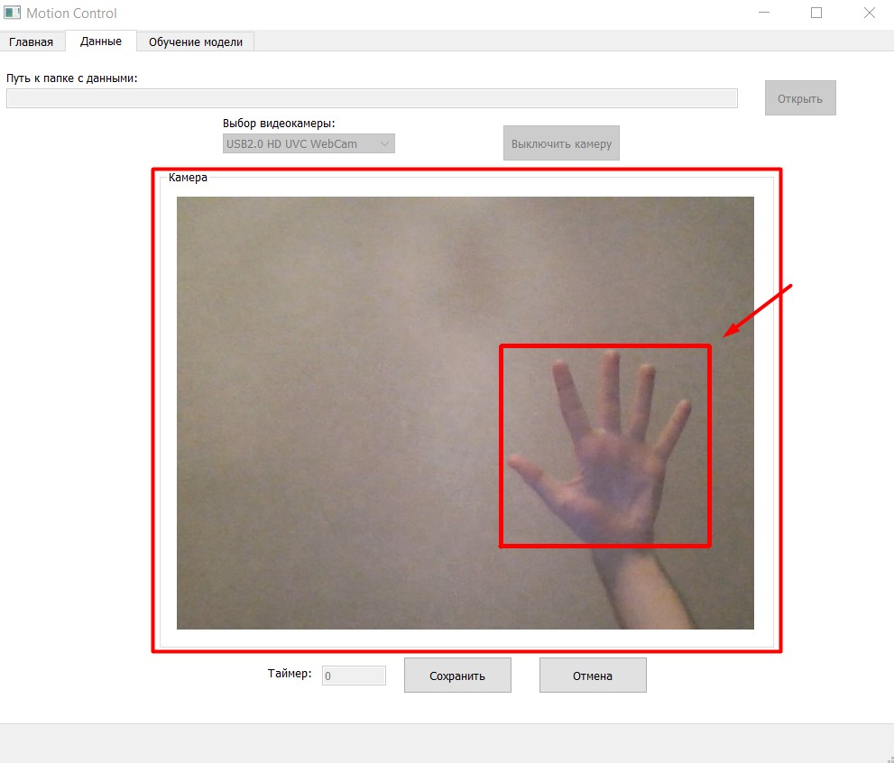
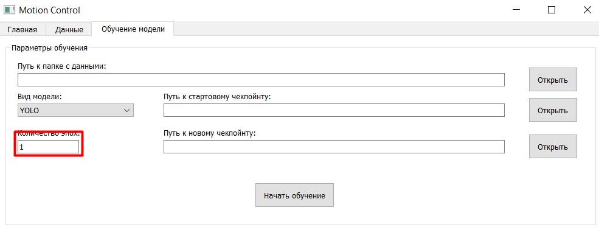

# Motion Computer Control

Проект представляет собой приложение, позволяющее контролировать действия компьютера с помощью жестов. 
Поступающее с веб-камеры изображение обрабатывается нейронной сетью, 
а затем, в зависимости от конкретного распознанного жеста, 
запускается python-скрипт, ранее привязанный к этому жесту.

## Оглавление.
### [Требования](#требования).
### [Установка и запуск приложения](#установка).
### [Создание и использование команд](#скрипты).
### [Особенности используемых моделей](#модели).
### [Интерфейс приложения](#интерфейс).
### [Возможности приложения](#возможности).
### [Пример использования программы](#пример).

## <a name="требования">Требования</a>:

Приложение работает на ОС Windows и Linux. Версия интерпретатора - python 3.9. Все необходимые зависимости указаны 
в файле requirements.txt. Docker в этом проекте не используется, т.к. в приложении есть графический интерфейс, 
написанный на PyQT5, сам проект предполагает доступ как минимум к веб-камере, а функционал, который даёт приложение, 
предполагает управление компьютером, из-за чего доступ может потребоваться и к другим устройствам. Всё это осложняет 
запуск приложения в контейнере, и использование Docker'а становится нецелесообразным.

## <a name="установка">Установка и запуск приложения</a>:

Для того, чтобы использовать приложение, необходимо скачать проект любым доступным способом. Например:

`git clone https://github.com/AlekseiRodionov/motion-computer-control.git`

Убедитесь, что используется интерпретатор python нужной версии, и все зависимости также установлены.  
Для использования приложения запустите файл MotionControlApp.py.

## <a name="скрипты">Создание и использование команд</a>:

Приложение работает по следующему принципу: нейросетевая модель получает изображение с веб-камеры, 
детектирует на нём жест (предсказывает его название и координаты), а затем запускает скрипт, привязанный к этому жесту. 
Скрипты с жестами связываются пользователем - можно написать свой код и указать путь к нему, чтобы при распознавании 
определённого жеста запускался нужный код. Данная связь сохраняется в файле с командами, который затем может 
быть загружен и использован.  
Используемые скрипты должны соответствовать следующим требованиям:   
1. В скрипте должна быть функция с названием main. Именно она и запускается при детектировании жеста, 
и в ней можно написать любой исполняемый код.  
2. Функция main должна принимать 3 аргумента: в качестве первого функция принимает сам жест 
(его название в виде строки), в качестве второго последовательность координат, соответствующих жесту 
(кортеж из четырёх чисел типа float), а в качестве третьего ссылку на сам объект класса CommandExecutor, который и
вызывает пользовательские скрипты. Таким образом, в своих скриптах пользователь имеет доступ к объекту, исполняющему
скрипты, и может влиять на его поведение. Для чего это нужно?  
Самый простой пример: допустим, нам нужно, чтобы одна из команд выполнялась лишь в том случае, если перед ней была 
выполнена конкретная команда. В таком случае нам может понадобиться перенести информацию из одного скрипта в другой. 
Можно воспользоваться полем commands_variables, предназначенным специально для этого.   
Другое возможное применение: при распознавании определённого жеста и выполнении соответствующего скрипта, можно
загрузить в объект класса CommandExecutor новый файл с командами, после чего к жестам будет привязан новый
набор команд. Таким образом можно прямо в процессе работы программы менять сценарии выполнения команд.  

См. примеры скриптов в папке algorithms/examples. 

## <a name="модели">Особенности используемых моделей</a>:

Т.к. скорость инференса в решаемой задаче должна быть высокой, то выбор модели встал между 
YOLO и SSDLite на MobileNetv3. В конце концов было решено реализовать функционал и с той, и с той моделью.  
Изначально предполагалось, что будет взята стандартная модель, обученная на датасете COCO, 
и далее она будет дообучена на выборке с изображениями, содержащими размеченные жесты.  
Но как выяснилось, в этом нет необходимости: такая задача уже решалась, 
и здесь (https://github.com/hukenovs/hagrid?tab=readme-ov-file) 
можно найти как выборку с жестами, так и обученные baseline-модели. Более того, baseline-модели обучались на большой
выборке изображений (1.5 ТБ изображений). Для домашнего ПК такая задача была бы неподъёмной, 
и нет смысла пытаться с нуля собрать сравнимую выборку данных, а также с нуля обучить на ней свою модель.
Поэтому данное приложение не создано для полноценного обучения и тестирования нейронных сетей - в нём нет тонкой 
настройки всех возможных параметров. Под обучением модели здесь понимается fine-tuning - дообучение последних слоёв
нейронной сети под свою выборку данных.  
Тем не менее, в большинстве случаев baseline-моделей будет достаточно.  

Метки соответствуют жестам следующим образом:  
0 = 'grabbing'  
1 = 'grip'  
2 = 'holy'  
3 = 'point'  
4 = 'call'  
5 = 'three3'  
6 = 'timeout'  
7 = 'xsign'  
8 = 'hand_heart'  
9 = 'hand_heart2'  
10 = 'little_finger'  
11 = 'middle_finger'  
12 = 'take_picture'  
13 = 'dislike'  
14 = 'fist'  
15 = 'four'  
16 = 'like'  
17 = 'mute'  
18 = 'ok'  
19 = 'one'  
20 = 'palm'  
21 = 'peace'  
22 = 'peace_inverted'  
23 = 'rock'  
24 = 'stop'  
25 = 'stop_inverted'  
26 = 'three'  
27 = 'three2'  
28 = 'two_up'  
29 = 'two_up_inverted'  
30 = 'three_gun'  
31 = 'thumb_index'  
32 = 'thumb_index2'  
33 = 'no_gesture'  
См. подробнее в первоисточнике: https://github.com/hukenovs/hagrid?tab=readme-ov-file  

## <a name="интерфейс">Интерфейс приложения</a>.

Интерфейс программы создан на PyQT5 с помощью дизайнера, затем ui-файл был конвертирован в py-файл, где далее 
интерактивным элементам вручную добавлена функциональность, а также прописана логика работы программы. Ниже
представлен внешний вид программы:
1. Вкладка "Главная":  

2. Вкладка "Данные":  

3. Вкладка "Обучение модели":  

Разберём подробно функционал представленного выше интерфейса.

## <a name="возможности">Возможности приложения</a>.

**1. Главная.**  
Вкладка "Главная" состоит из двух блоков - "Настройка команд" и "Настройка детектора". 
В блоке "Настройка команд" находятся элементы, отвечающие за подключение конкретных алгоритмов к конкретным жестам:  
1. Создание файла с командами.  
  
Если ни одного файла с командами не существует, либо если нужен новый файл с командами, то его можно создать, 
нажав на указанную выше кнопку. Откроется стандартное окно выбора файла, в котором можно указать путь к создаваемому файлу.
После этого по указанному адресу будет создан пустой json-файл, в котором в будущем можно будет записывать команды.  
2. Загрузка файла с командами.  
   
Здесь же находится и кнопка "Открыть", с помощью которой можно указать путь к уже имеющемуся json-файлу с командами.

В созданный или загруженный json-файл можно добавлять команды, а также их можно удалять. Ниже мы разберём, 
как это делается.   
3. Выбор жеста.
   
Данный выпадающий список позволяет выбирать жест, который будет вызывать ту или иную последовательность действий.
Всего доступно для выбора 33 жеста.  
4. Выбор алгоритма.  
   
С помощью данной кнопки можно указать путь к python-скрипту, который должен запускаться при детектировании 
указанного жеста.  
ВАЖНО! К скриптам есть определённые требования. См. подробнее: [Создание и использование команд](#скрипты).  
5. Сохранение команды.  
  
Когда жест и соответствующий ему алгоритм выбраны, их можно объединить в одну команду с помощью указанной выше кнопки.
При нажатии на неё, команда записывается в json-файл с командами.  
8. Показ команд.  
  
С помощью указанной выше кнопки можно посмотреть, какие python-скрипты каким жестам соответствуют.   
7. Удаление команды.  
  
Лишнюю команду можно удалить из json-файла с командами. Для этого используется указанная выше кнопка. Указывать 
соответствующий жесту python-скрипт нет необходимости - достаточно указать сам жест.  

Следующий блок - это "Настройка детектора". Он отвечает за выбор конкретной модели для детектирования жестов, 
а также настройки параметров этой модели. Здесь же находится кнопка "Старт", запускающая детектор.
Разберём подробнее этот блок:  
1. Выбор вида модели.  
  
Данный выпадающий список позволяет выбрать один из трёх типов используемых моделей - YOLO, SSDLite или ONNX. В данном 
случае модели типа YOLO работают с изображениями большего разрешения (640x640), модели типа SSDLite - с изображениями 
меньшего разрешения (320x320). При этом модели могут принимать на вход изображение любого размера - оно будет 
преобразовано к нужному размеру.  
И YOLO, и SSDLite могут быть экспортированы в ONNX-формат (см. раздел "Обучение модели"). 
ONNX-модели являются наиболее производительными и рекомендуются к применению. Разрешение изображений для ONNX-моделей
может быть указано при экспорте.  
2. Загрузка чекпойнта.  
   
С помощью данной кнопки можно указать путь к конкретному чекпойнту. Изначально доступны два чекпойнта, представленные в 
оригинальной работе - "YOLOv10n_gestures.pt" для YOLO и "SSDLiteMobileNetV3Large.pth" для SSDLite, однако пользователь 
может дообучать модели на своих данных и получать свои чекпойнты, о чём мы скажем далее. Также был добавлен 
чекпойнт "YOLOv10n_gestures.onnx" ONNX-модели, полученной из "YOLOv10n_gestures.pt".  
ВАЖНО! Чекпойнт должен соответствовать типу модели. Нельзя использовать SSDLiteMobileNetV3Large.pth при выбранном типе
YOLO и наоборот.  
3. Выбор камеры.   
  
С помощью данного выпадающего списка можно выбрать, какая камера будет использоваться приложением. Например, если в 
ноутбуке имеется встроенная веб-камера, а также к нему подключена веб-камера по USB, то данный выпадающий список 
позволит выбрать одну из них.  
4. Настройка Confidence.  
  
Данное поле ввода позволяет настроить уровень "уверенности" модели. При высоких значениях модель предпочтёт скорее 
допустить ошибку и пропустить ваш жест, чем допустить ошибку и распознать жест там, где его нет. При низких значениях 
наоборот - модель будет лучше распознавать ваши жесты, но при этом чаще "видеть" их в случайном шуме. Настраивая этот 
параметр, пользователь может подобрать нужный для своих задач уровень "уверенности". Confidence измеряется в диапазоне 
от 0 до 1 и изначально установлен в значении 0.5.  
5. Настройка Intersection over Union.  
  
Данное поле позволяет настраивать параметр Intersection over Union, который отвечает за то, сколько объектов может быть 
распознано в одном месте на изображении. Например, если два жеста на изображении находятся рядом друг с другом, то их 
ограничивающие рамки могут накладываться друг на друга, как в примере ниже:  
   
Intersection over Union отвечает за то, при какой области пересечения две ограничивающих рамки объединяются в одну. 
При низких значениях для объединения двух детекций в одну требуется большая область пересечения, при высоких значениях - 
меньшая. Значение параметра также находится в диапазоне от 0 до 1.  
6. Старт.  
   
Старт детектора. При нажатии этой кнопки запускается основная часть программы. Модель считывает изображение с выбранной 
камеры, детектирует на нём жесты, выполняет команды в соответствие с выбранным json-файлом с командами.

Вкладки "Главная" достаточно для полноценной настройки и запуска программы. Однако у пользователя есть возможность
улучшить имеющиеся модели, дообучить их под свои задачи. Для этого используются две другие вкладки.  

**2. Данные.**  
На вкладке "Данные" представлен функционал для создания собственного набора данных, на которых могут быть дообучены модели:  
1. Выбор папки с данными.  
  
Указанная выше кнопка позволяет выбрать путь к папке, в которую будут сохраняться данные для дальнейшего обучения модели.  
2. Выбор камеры.   
  
Приведённый выше выпадающий список позволяет выбрать используемую камеру, подобно тому, как это было сделано на вкладке 
"Главная".  
3. Включение/выключение камеры.   
  
Данная кнопка позволяет включать (и выключать) камеру, чтобы с её помощью делать снимки, которые затем будут сохранены
в качестве данных для обучающей выборки.  
4. Установка таймера.  
   
В указанном поле ввода можно ввести задержку, после которой делается фото. Задержка может быть полезна, если на фото 
необходимо зафиксировать жест, который делается с помощью двух рук.  
5. Фото.  
  
Когда камера включена, кнопка "Сделать фото" становится доступной. При нажатии на неё, начинается обратный отсчёт таймера,
после окончания которого в поле камеры будет сохранён последний кадр:    
    
При этом кнопки "Сохранить" и "Отмена" (см. ниже) станут видимыми.  
6. Выделение объектов.  
После того, как кнопка "Сделать фото" была нажата, и кадр был зафиксирован, на этом кадре можно выделить все нужные 
ограничивающие рамки, а также присвоить классы всем выделенным объектам. Для этого нужно сначала нажать левой кнопкой
мыши на изображении в том месте, где должен находиться левый нижний угол ограничивающей рамки объекта:  
    
Затем нужно также нажать на изображении в том месте, где должен находиться правый верхний угол ограничивающей рамки 
того же объекта:  
  
В результате появится окно для ввода названия класса объекта:  
   
Если нажать в этом окне кнопку "Cancel", то результаты выделения сбросятся. Если ввести название класса и нажать "OK",
то объект будет помечен соответствующим именем:  
  
Таким образом можно выделять на фото любое количество объектов.  
7. Сохранение данных.  
  
Указанная выше кнопка позволяет сохранить данные. В папке с данными создаются подпапки "images" и "labels", а также
yaml-файл, нужный для обучения YOLO-моделей (если эти файлы и папки не были созданые ранее). В папку images сохраняется
фото (без нарисованных поверх них ограничивающих рамок) в формате .jpg, а в папку labels в файл с таким же именем, но
в формате .txt, сохраняются координаты ограничивающих рамок всех выделенных объектов, а также их классы.  
8. Отмена.  
  
Данная кнопка позволяет сбросить все выделения и продолжить работу без сохранения текущей фотографии.  

Для того, чтобы модель хорошо обучалась, рекомендуется собирать как можно больше данных. При этом выборка должна быть
как можно более разнообразной.  

**3. Обучение модели.**  
Третья вкладка приложения предоставляет функционал для обучения и тестирования моделей. 
См. подробнее: [Особенности используемых моделей](#модели).   
Вкладка "Обучение модели" состоит из двух блоков: "Параметры обучения" и "Результаты тестирования". 
Рассмотрим первый блок:  

1. Выбор папки с данными.  
  
С помощью указанной кнопки можно выбрать папку, в которой содержатся тренировочные данные, созданные ранее на вкладке
"Данные". В выбранной папке должны быть две подпапки - "images" и "labels", в которых, соответственно, должны 
находиться сохранённые фото и отмеченные на них объекты, а также файл "data.yaml", который создаётся
автоматически при сохранении данных.  
2. Выбор типа модели.  
  
Данный выпадающий список позволяет выбрать тип обучаемой модели - YOLO или SSDLite.  
3. Выбор стартового чекпойнта.  
  
Данная кнопка позволяет выбрать путь к стартовому чекпойнту. Именно с него будет начинаться обучение.  
ВНИМАНИЕ! Выбранный чекпойнт должен соответствовать выбранному типу модели. Нельзя использовать тип модели "YOLO" с
чекпойнтом "SSDLiteMobileNetV3Large.pth" и наоборот.  
4. Выбор количества эпох.  
  
В данное поле вводится целое число, указывающее количество эпох, в течение которых нейронная сеть будет обучаться. 
При прочих равных, чем больше эпох, тем лучше будут результаты обучения и тем дольше время обучения.  
5. Выбор конечного чекпойнта.  
   
Данная кнопка позволяет выбрать путь и имя чекпойнта обученной модели.  
ВНИМАНИЕ! Если имя стартового и имя конечного чекпойнтов будут одинаковыми, то стартовый чекпойнт перезапишется!  
6. Начало обучения.  
   
Данная кнопка запускает обучение модели.  

Далее идёт блок "Экспорт модели". Его функции:   
1. Выбор чекпойнта.  
  
Указанная выше кнопка позволяет выбрать путь к чекпойнту модели, которая будет экспортирована в onnx-формат.
Экспортировать в onnx-формат можно только YOLO-модель.   
2. Выбор размера входа модели.  
  
Данные поля позволяют указать размерность входа модели (размер изображений, которые модель принимает на вход). 
Уменьшение размерности входа модели повышает скорость работы, но потенциально может
ухудшить качество модели. Если изображения, подаваемые на вход получившейся модели, не совпадают
с указанным входом, то размер изображений будет изменён.  
3. Экспорт модели.  
  
Эта кнопка запускает экспорт модели. Если все данные для экспорта указаны верно, то в папке с указанным чекпойнтом 
создаётся новый чекпойнт - с таким же именем, что и старый, но с расширением .onnx.   

Следующим идёт блок "Результаты тестирования". Разберём его функции:  
1. Выбор чекпойнта.  
  
Указанная выше кнопка позволяет выбрать путь к чекпойнту тестируемой модели.  
2. Выбор типа модели.  
  
Данный выпадающий список, как и во всех предыдущих разделах, позволяет выбрать тип тестируемой модели - 
YOLO, SSDLite или ONNX.  
3. Выбор камеры.  
  
Данный выпадающий список позволяет выбрать, какая из доступных камер будет использоваться при тестировании.  
4. Выбор confidence и iou.  
  
Данные поля ввода позволяют настроить параметры confidence и intersection over union аналогично тому, как это делается
на вкладке "Главная".  
5. Начать тестирование.  
  
Эта кнопка запускает тестирование модели. Тестирование выглядит следующим образом: создаётся новое окно с принимаемым с
выбранной камеры видеопотоком, на котором нейронная сеть в реальном времени детектирует жесты. Чтобы закончить 
тестирование, необходимо либо закрыть появившееся окно с консолью, либо нажать на окно с видеопотоком и затем нажать
клавишу 'q' (в английской раскладке) на клавиатуре.   

## <a name="пример">Пример использования программы.</a>

Функционал интерфейса уже был разобран выше. Но для того, чтобы было проще разобраться в порядке использования тех или 
иных его элементов, ниже приведён простой пошаговый пример использования программы.  

Итак:
1. Создадим новый командный файл, нажав на соответствующую кнопку:

   

   
В итоге можно увидеть, что путь к созданному файлу появится в соответствующей строке ввода:

   
2. Создадим команду. Для этого сначала выберем в выпадающем списке любой жест:

   
Затем с помощью кнопки "Открыть" укажем путь к скрипту, который будет выполняться при детектировании жеста:
  

   

   
Результат:
  

   
Теперь нажмём на кнопку "Сохранить команду":
  

   
Если всё сделано верно, получим следующее сообщение:
  
   

3. Выберем используемую для детектирования модель. Пусть это будет YOLO. Тогда тип модели остаётся по-умолчанию, 
укажем чекпойнт модели. Для этого нажмём на соответствующую кнопку "Открыть":
  

   
Укажем путь к файлу:
  

   
Указанный путь отобразится в соответствующей строке ввода:
  
   

4. Видеокамеру, confidence и iou оставим по-умолчанию.  

5. Нажимаем кнопку "Старт":
  

   
Появится следующее окно:

   
В нём ничего не нажимаем. Некоторое время ждём, пока программа запустится. Как только появится следующий текст:
  

   
Программой можно пользоваться. Показываем в свою камеру выбранный ранее жест - получаем результат:
  
   
